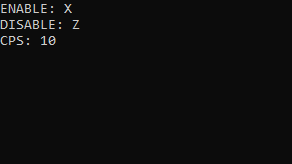

# FRCLICKER
A simple application that simulates clicking the left mouse button. You can set the number of clicks per second and buttons (must be uppercase) to turn the autoclicker on and off. 
 

# How to use
1. Run FRCLICKER
2. Input key you want to enable and disable FRCLICK with (must be uppercase)
3. Input CPS
4. Enable and disable it with the buttons selected before
